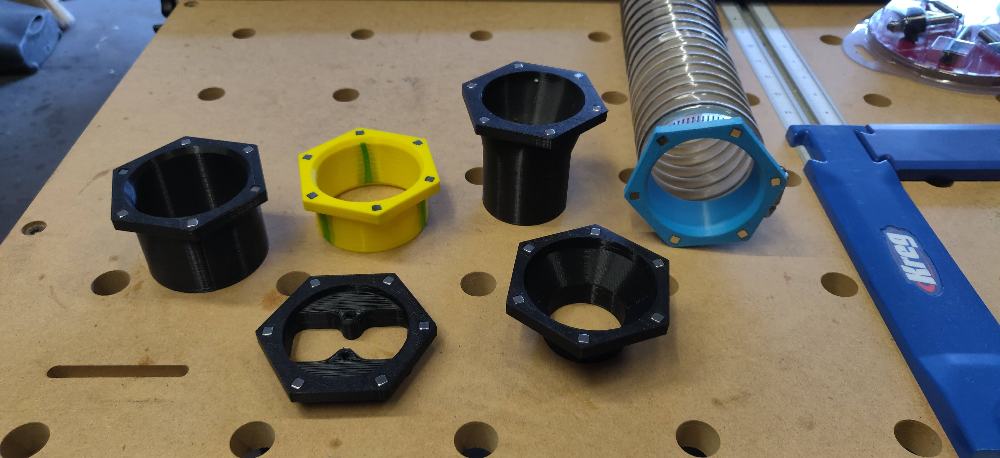
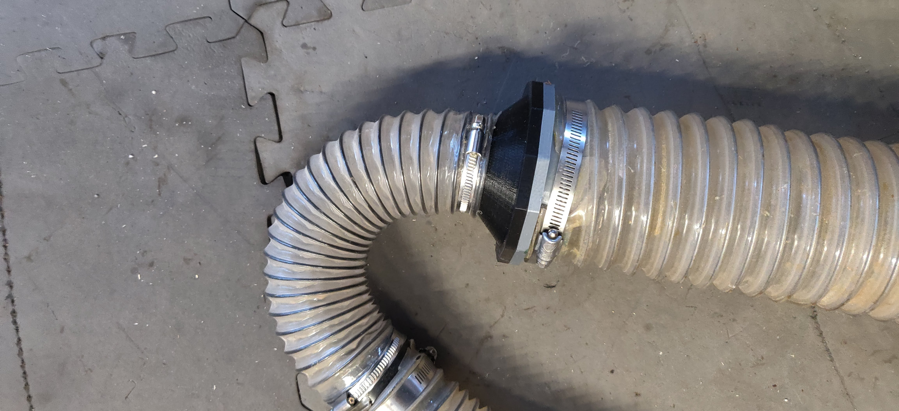
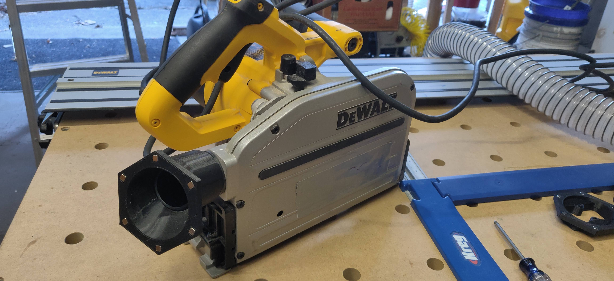
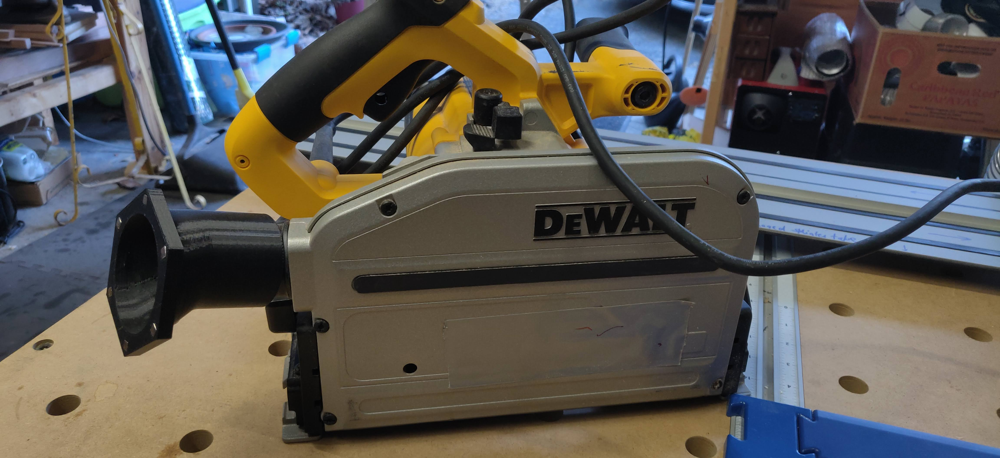
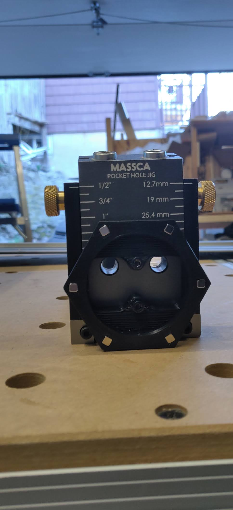
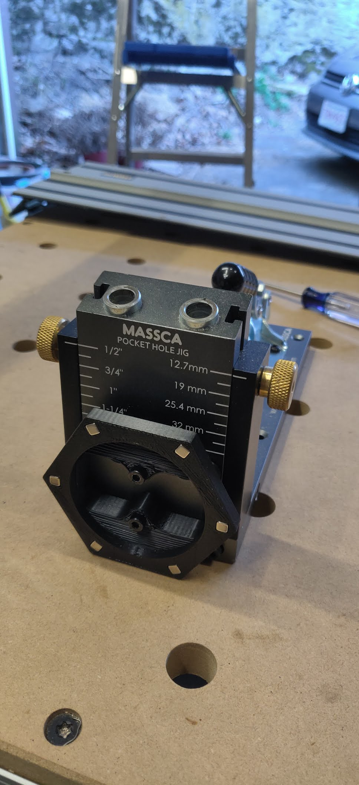
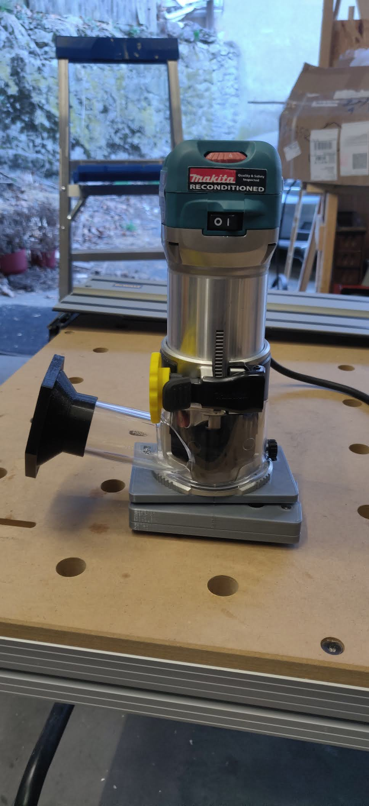
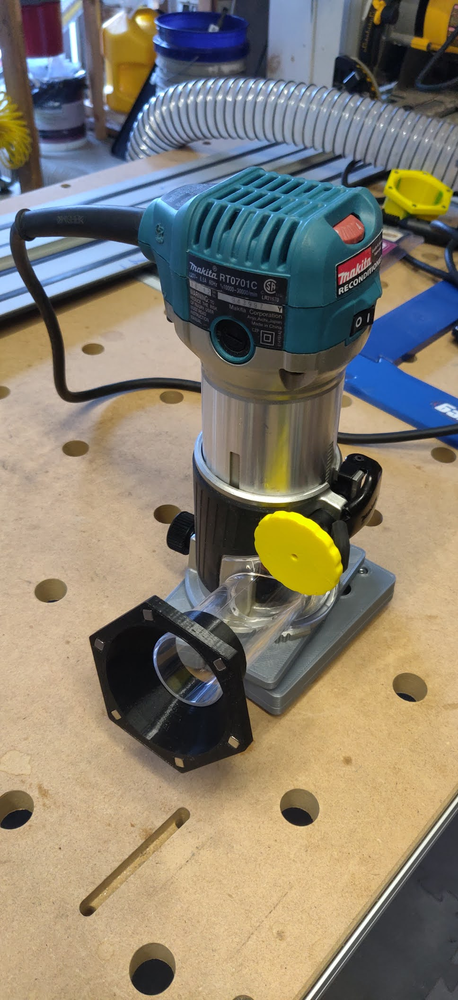

# magnetic_dust_fittings
A collection of interconnecting magnetic dust fittings for use in a woodshop. 
In order to simplify the immense number of dust fittings, every fitting is 
standardized to either a 2.5" or a 4" style magnetic flange style.
The 2.5" flange needs 6 x 4.75mm neodymium magnets and the 4" flange uses 12 magnets.

Magnets can be bought at many online stores including 
- [KJMagnetics](https://www.kjmagnetics.com/products.asp?cat=11&scri=25)
This is where I got my magnets
- [AppliedMagnets](https://appliedmagnets.com/)
This is probably where I'll get more from if I need some.

You should probably get a mix of N35, N42 and N52 magnets. 
I also recommend creating a color scheme with the fittings 
as you can see in my photos. All black fittings have only N35 magnets.
Most of these fittings go onto the actual dust producing device.

The hose fitting that will connect to these dust producing devices is
printed in blue and has all N42/52 magnets. Thereby making a slightly
more robust connection while not using so many N42/N52 magnets.

*Unfortunately, I am an engineer, and if there is a variable
I try to optimize for something, sigh*

There are following fittings in this library, I'll update as I add more.
1. Standard 2.5" dust collection hose fitting, secured with a hose clamp
2. Standard 4" dust collection hose fitting, secured with a hose clamp
3. 2.5" flange for Dewalt track saws and Miter saws, friction fit
4. 2.5" flange for Makita 0701c router, friction fit
5. 2.5" flange for Massca pocket hole jig, screw mounted using the same screws as used by the OE dust fitting
6. 2.5" flange for PVC 2in Sch40 pipe, friction fit. I use it with my DiY shop vacuum broom
7. 4" flange for PVC 4in DWV pipe, friction fit.
8. 4" to 2.5" reducer. The reducer clamps onto the 2.5" hose side, mating with a 4" magnetic face.

Here's an image gallery
<table style="padding:10px; vertical-align: bottom;">
  <tr>
    <td colspan=2>
2.5" hose fittings
</td>
    <td colspan=2>
2.5" to 4" coupler
</td>
  </tr>
  <tr>
    <td colspan=2>
Dewalt Track Saw
</td>
    <td colspan=2></td>
  </tr>
  <tr>
    <td>
Massca pocket hole jig
</td>
    <td></td>
    <td>
Makita RT0701c
</td>
    <td></td>
  </tr>
  
</table>
